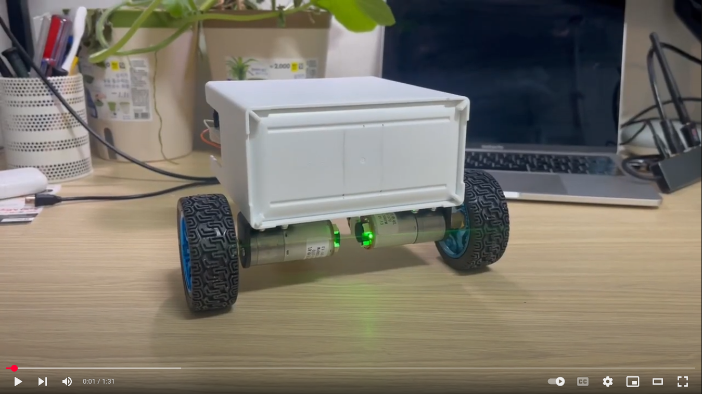
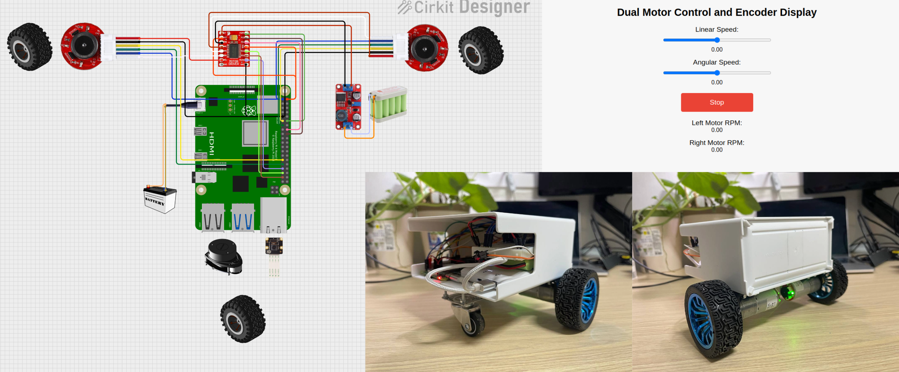

## Due to raspberry pi's low 2gb memory we could not run slam&navigation on the device. You can still create mobile robot that can be controlled on your phone throuh web controll gui 
## So we will continue this project with Jetson nano b1 on - github/...
# Autonomous ROS Project

This project integrates multiple sensors and actuators on a mobile robot platform to achieve autonomous navigation. The system runs on a Raspberry Pi 4B (2GB) and combines motor control, encoder feedback, LIDAR scanning, SLAM, navigation, camera vision, and line tracking.
---
[](https://youtu.be/JTg8ff2hSGM?si=UqfauM6vN_xyPFOV)
---
> **Status Overview:**  
> - **Completed:** Motor control node, encoder node, and web GUI for remote control  
> - **In Progress:** RP‑Lidar scan node, SLAM integration, navigation stack, camera & object detection, and line tracking
aBelow is a revised, polished version of your README that consolidates information, removes duplicates, fills in missing details, and adds a section on Dockerization. You can adjust details (such as package names, file paths, or contact information) as needed.

---

# Autonomous ROS Project

This project integrates multiple sensors and actuators on a mobile robot platform to achieve autonomous navigation. The system runs on a Raspberry Pi 4B (2GB) with Ubuntu 22.04 and ROS 2 Humble. It combines motor control, encoder feedback, LIDAR scanning, SLAM, navigation, camera vision, and line tracking.

[](https://youtu.be/JTg8ff2hSGM?si=UqfauM6vN_xyPFOV)

> **Status Overview:**  
> - **Completed:** Dual Motor Control Node, Encoder Node, Web GUI for remote control  
> - **In Progress:** RP‑Lidar Scan Node, SLAM integration, Navigation Stack, Camera & Object Detection, Line Tracking



---

## Table of Contents

- [Hardware Components](#hardware-components)
- [Circuit Connection & Wiring Details](#circuit-connection--wiring-details)
- [Software Overview and Nodes](#software-overview-and-nodes)
  - [Dual Motor Control Node](#dual-motor-control-node)
  - [Encoder Node](#encoder-node)
  - [Web GUI Node](#web-gui-node)
  - [RP‑Lidar Scan Node (In Progress)](#rp-lidar-scan-node-in-progress)
  - [SLAM Node (In Progress)](#slam-node-in-progress)
  - [Navigation Node (In Progress)](#navigation-node-in-progress)
  - [Camera / Object Detection Node (In Progress)](#camera--object-detection-node-in-progress)
  - [Line Tracking Node (In Progress)](#line-tracking-node-in-progress)
- [Creating New Nodes](#creating-new-nodes)
- [To-Do List](#to-do-list)
- [Installation and Launch Instructions](#installation-and-launch-instructions)
- [Dockerization](#dockerization)
- [License](#license)

---

## Hardware Components

- **Raspberry Pi 4B (2GB)**  
  - Runs Ubuntu 22.04 and ROS 2 Humble.
- **TB6612 Dual Motor Driver**  
  - Controls two DC motors via PWM and direction signals.
- **2 × JGA25-370 DC 6V Geared Motors with Encoders and Wheels**  
  - Provide propulsion and motion feedback.
- **7.2V 4500mAh Li-ion Battery**  
  - Powers the motors (via the motor driver's VM and GND outputs).
- **5V 5000mAh Power Bank**  
  - Powers the Raspberry Pi via its Type-C connector.
- **RP‑Lidar A1**  
  - Provides 2D LaserScan data on the `/scan` topic for SLAM and obstacle detection.
- **Raspberry Pi Camera**  
  - For vision-based tasks such as object detection and line tracking.
- **Extra Balance Wheel**  
  - Helps maintain stability.
- **XL6015 Boost Converter**  
  - Used if voltage adaptation is needed (e.g., when using a 12V battery).

---

## Circuit Connection & Wiring Details

### Raspberry Pi 4B Connections

- **Motor Driver (TB6612FNG):**
  - **PWMA (Left Motor PWM):** GPIO18 → TB6612FNG PWMA
  - **AI1 (Left Motor Direction):** GPIO23 → TB6612FNG AI1
  - **AI2 (Left Motor Direction):** GPIO24 → TB6612FNG AI2
  - **PWMB (Right Motor PWM):** GPIO13 → TB6612FNG PWMB
  - **BI1 (Right Motor Direction):** GPIO19 → TB6612FNG BI1
  - **BI2 (Right Motor Direction):** GPIO26 → TB6612FNG BI2
  - **STBY & VCC:** 5V → TB6612FNG (enables driver and provides logic power)
  - **GND:** Common ground

- **Motors with Encoders (JGA25-371dc):**
  - **Motor Power:**
    - **Motor Power +:** Connected to TB6612FNG outputs (A01/B01)
    - **Motor Power -:** Connected to TB6612FNG outputs (A02/B02)
  - **Encoder Power:**
    - **Encoder Power +:** 3V3 from Raspberry Pi
    - **Encoder Power -:** GND
  - **Encoder Signals:**
    - **Channel 1 / A (C1/A):** Connect to GPIO5 and/or GPIO17
    - **Channel 2 / B (C2/B):** Connect to GPIO6 and/or GPIO27

- **Power:**
  - **Raspberry Pi:** Powered via a 5V 5000mAh power bank (Type-C)
  - **Motors:** Powered by a 7.2V 4500mAh Li-ion battery connected to TB6612FNG VM and GND

### TB6612FNG Motor Driver Connections

- **Inputs (from Raspberry Pi):**
  - **Left Motor:** PWMA (GPIO18), AI1 (GPIO23), AI2 (GPIO24)
  - **Right Motor:** PWMB (GPIO13), BI1 (GPIO19), BI2 (GPIO26)
- **Power & Enable:**
  - **STBY & VCC:** 5V (from Raspberry Pi)
  - **VM:** 7.2V Li-ion battery
  - **GND:** Common ground
- **Outputs (to Motors):**
  - **A01, B01:** Motor Power +
  - **A02, B02:** Motor Power -

### Additional Components

- **RP‑Lidar A1:**  
  - Connect via USB (e.g., `/dev/ttyUSB0`) and configure in its launch file.
- **Raspberry Pi Camera:**  
  - Connect to the dedicated camera interface.
- **Balance Wheel:**  
  - Mount mechanically to help stabilize the robot.

---

## Software Overview and Nodes

### Dual Motor Control Node

- **Status:** Complete  
- **Location:** `src/dual_motor/dual_motor/dual_motor_controller.py`  
- **Description:**  
  Subscribes to `/cmd_vel` (Twist messages) and drives the TB6612FNG using PWM signals to control motor speed and direction.
- **Key Topics:**
  - **Subscribed:** `/cmd_vel`
- **Creation Steps:**
  1. Create package:
     ```bash
     ros2 pkg create --build-type ament_python dual_motor --dependencies rclpy std_msgs
     ```
  2. Implement node using RPi.GPIO.
  3. Update `package.xml` and `setup.py`.

---

### Encoder Node

- **Status:** Complete  
- **Location:** `src/motor_encoder/motor_encoder/dual_encoder_node.py`  
- **Description:**  
  Reads encoder signals via GPIO interrupts and publishes RPM data on `/left_motor_rpm` and `/right_motor_rpm`.
- **Key Topics:**
  - **Published:** `/left_motor_rpm`, `/right_motor_rpm`
- **Creation Steps:**
  1. Create package:
     ```bash
     ros2 pkg create --build-type ament_python motor_encoder --dependencies rclpy sensor_msgs std_msgs
     ```
  2. Implement node using RPi.GPIO.
  3. Update `package.xml` and `setup.py`.

---

### Web GUI Node

- **Status:** Complete  
- **Location:** `src/my_robot_launch/launch/web_gui/index.html`  
- **Description:**  
  An HTML/JavaScript interface (using roslib.js) for remote control and monitoring. It publishes motor commands to `/cmd_vel` and subscribes to encoder topics.
- **Key Topics:**
  - **Published:** `/cmd_vel`
  - **Subscribed:** `/left_motor_rpm`, `/right_motor_rpm`
- **Creation Steps:**
  - Place your `index.html` and `roslib.min.js` files in `launch/web_gui/`.
  - Serve the directory using a simple HTTP server (see Unified Launch File below).

---

### MY ROBOT LAUNCH Node

- **Status:** Complete  
- **All Nodes Location:** `src/my_robot_launch/launch/autonomous_car_launch.py`  
- **Launch file:** `src/my_robot_launch/launch/launchpr.py`
- **Description:**  
  All nodes to launch at once. 
- **Creation Steps:**
  - Place web_gui in launch folder.
  - Update `package.xml` and `setup.py`.


---

### RP‑Lidar Scan Node (In Progress)

- **Status:** In Progress  
- **Location:** Typically provided by the `rplidar_ros` package.
- **Description:**  
  Reads LIDAR data from the RP‑Lidar A1 and publishes LaserScan messages on `/scan`.
- **Key Topics:**
  - **Published:** `/scan`
- **Creation Steps:**  
  Install via apt:
  ```bash
  sudo apt install ros-humble-rplidar-ros
  ```
  and include it in your autonomous car launch file.

---

### SLAM Node (In Progress)

- **Status:** In Progress  
- **Location:** `src/my_robot_slam/` (using slam_toolbox)
- **Description:**  
  Uses `async_slam_toolbox_node` (or sync version) to build a map from LIDAR data and publishes `/map` along with TF transforms.
- **Key Topics:**
  - **Subscribed:** `/scan`
  - **Published:** `/map`
- **Creation Steps:**  
  Create a configuration file in `config/` and a launch file to start the SLAM node. Install via:
  ```bash
  sudo apt install ros-humble-slam-toolbox
  ```

---

### Navigation Node (In Progress)

- **Status:** In Progress  
- **Location:** In a package like `my_robot_nav` or via the Navigation2 stack.
- **Description:**  
  Provides autonomous navigation using planners and costmaps.
- **Key Topics:**
  - **Subscribed:** `/map`, `/scan`, `/odom`
  - **Published:** `/cmd_vel`
- **Creation Steps:**  
  Create navigation parameters (e.g., `nav2_params.yaml`) and a launch file for Nav2.

---

### Camera / Object Detection Node (In Progress)

- **Status:** In Progress  
- **Location:** `src/camera_node/` or `src/object_detection/`
- **Description:**  
  Captures images with the Raspberry Pi camera (or USB camera) using OpenCV and publishes them on `/camera/image_raw`. Optionally runs object detection.
- **Key Topics:**
  - **Published:** `/camera/image_raw`
- **Creation Steps:**  
  Create a package:
  ```bash
  ros2 pkg create --build-type ament_python camera_node --dependencies rclpy sensor_msgs cv_bridge
  ```
  Implement the node with OpenCV and cv_bridge.

---

### Line Tracking Node (In Progress)

- **Status:** In Progress  
- **Location:** `src/line_tracking/line_tracking/line_tracking_node.py`
- **Description:**  
  Processes camera images to detect and follow a line, publishing velocity commands to `/cmd_vel`.
- **Key Topics:**
  - **Subscribed:** `/camera/image_raw`
  - **Published:** `/cmd_vel`
- **Creation Steps:**  
  Create a package:
  ```bash
  ros2 pkg create --build-type ament_python line_tracking --dependencies rclpy sensor_msgs cv_bridge geometry_msgs
  ```
  Implement the node using OpenCV.

---

## Creating New Nodes

1. **Create a New Package:**  
   ```bash
   ros2 pkg create --build-type ament_python <package_name> --dependencies rclpy <other_dependencies>
   ```
2. **Write the Node Script:**  
   Place your Python script (with a proper shebang, e.g., `#!/usr/bin/env python3`) in `src/<package_name>/` and make it executable:
   ```bash
   chmod +x src/<package_name>/<node_script>.py
   ```
3. **Update `package.xml` and `setup.py`:**  
   Ensure all dependencies are declared.
4. **Build the Package:**  
   ```bash
   colcon build --packages-select <package_name>
   source install/setup.bash
   ```
5. **(Optional) Create a Launch File:**  
   Use Python launch files to start your node(s).

---

## To-Do List

- [x] Dual Motor Control Node  
- [x] Encoder Node  
- [x] Web GUI  
- [ ] RP‑Lidar Scan Node  
- [ ] SLAM Integration (using slam_toolbox)  
- [ ] Navigation Stack (Nav2)  
- [ ] Camera / Object Detection Node  
- [ ] Line Tracking Node  

---

## Installation and Launch Instructions

1. **Build the Workspace:**  
   From the workspace root (`autonomous_ROS/`):
   ```bash
   colcon build
   source install/setup.bash
   ```

2. **Launch All Nodes:**  
   Use the unified launch file in the `my_robot_launch` package:
   ```bash
   ros2 launch my_robot_launch all_nodes_launch.py
   ```
   This will:
   - Launch autonomous car nodes (motor control, encoder, etc.)
   - Start the rosbridge server (on port 9090)
   - Start the HTTP server (serving the web GUI on port 8000)

3. **Access the Web GUI:**  
   Open a web browser on a device in the same network and navigate to:
   ```
   http://<raspberry_pi_ip>:8000
   ```
   For example, if the Pi's IP is `192.168.219.100`, use:
   ```
   http://192.168.219.100:8000
   ```

4. **Remote Visualization (Optional):**  
   Run RViz on another machine (with ROS 2 Humble) to view topics such as `/map` and `/scan`.

---

## Dockerization

To simplify deployment and ensure a consistent environment, you can containerize your project using Docker.

### Example Dockerfile

Place check Dockerfile in the root directory (`autonomous_ROS/Dockerfile`)

### Building and Running the Docker Container

1. **Build the Image:**
   ```bash
   docker build -t autonomous_ros_project .
   ```

2. **Run the Container (using host networking for ROS 2 DDS discovery):**
   ```bash
   docker run -d \
    --privileged \
    --restart=always \
    --name auto_ros \
    --network=host \
    autonomous_ros_project

   ```

3. **Access the Web GUI:**  
   Open a browser and navigate to:
   ```
   http://<raspberry_pi_ip>:8000
   ```

---

## License

This project is licensed under the MIT License. Feel free to modify, distribute, or use this code for personal, educational, or commercial purposes, provided proper attribution is given.

---

*For issues or contributions, please contact jakhon37@gmail.com*
